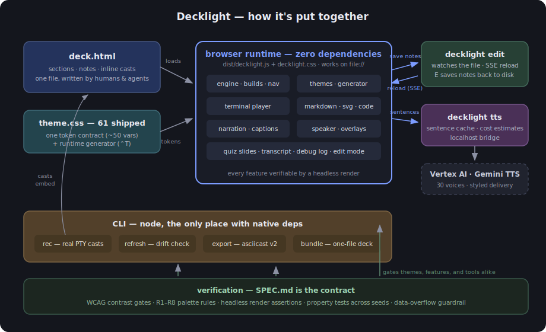

<p align="center">
  
</p>

# Decklight

**The presentation library that presents itself.**

Slides as a single HTML file, written by your agent — no build, no server, no framework. Decklight is a presentation library in the Reveal.js tradition, designed to be **authored by AI agents and humans alike**. A deck is a single HTML file. The runtime is one JS + one CSS + one theme CSS. There is no build step, no dev server — double-click the file and present. And because agents can't eyeball a slide, every feature is designed to be **verifiable by a headless render**: clipped content marks itself in the DOM, every theme passes machine-checked contrast gates, terminal demos are recorded truth rather than screenshots.

**See it live at [decklight.io](https://decklight.io)** — the showcase deck, embedded and narrating itself; the whole page ships from one `decklight bundle` command. `SPEC.md` is the contract; this README is the tour. For the tour that gives itself, open **`demo/showcase.html`** — a deck about Decklight where every slide live-demos the feature it describes, ending in a pop quiz.

## Why Decklight

- **One file, zero build** — author a single HTML file, double-click it, present.
- **Agent-native authoring** — describe a slide in plain English to your favorite agent; overflow flags, contrast gates and headless render assertions let it verify the result without eyes.
- **Diagrams & graphics** — not only bullet lists: shapes, diagrams and full graphics, all native, theme-aware SVG.
- **Animation** — progressive builds, Magic Move between slides, and SVG diagrams that literally draw themselves in.
- **61 built-in themes** — every one passes WCAG contrast gates and codified palette rules; diagrams and terminals reskin too. Generate your own with a keystroke.
- **Truthful terminals** — real PTY recordings replayed truthfully, never a video, down to the synthesized key clicks.
- **Live narration** — text-to-speech, on the fly or cached, presents the deck by itself, perfectly in sync — captions and pop quiz included.
- **Everything is text** — no binary formats anywhere, so decks diff cleanly in git and agents can read, review, and edit every byte.
- **Command palette** — press `/` for every command with its shortcut; type to filter, `Enter` runs it.

## Quick start

```
npx decklight init "My Deck"
```

Scaffolds a self-contained `deck.html` (double-click it, no server) plus `.claude/skills/decklight/` — so Claude Code (or anything reading `AGENTS.md`) has the full authoring contract on hand instead of guessing from Reveal.js memory or a web search.

Or hand-author the anatomy directly:

```html
<!doctype html>
<html lang="en">
<head>
  <meta charset="utf-8">
  <link rel="stylesheet" href="decklight/dist/decklight.css">
  <link rel="stylesheet" href="decklight/themes/aurora.css">
</head>
<body>
  <div class="decklight">
    <section>
      <h2>A plain HTML slide</h2>
      <p>With an auto-detected subtitle</p>
      <ul data-build>
        <li>First point</li>
        <li>Second point — steps in on the next advance</li>
      </ul>
      <aside class="notes">Speaker notes. ⟨CLICK⟩ markers align with builds.</aside>
    </section>
  </div>
  <script src="decklight/dist/decklight.js"></script>
  <script>Decklight.init({ transition: 'fade' });</script>
</body>
</html>
```

Open the file in a browser — `file://` works for everything, no server needed. See `demo/showcase.html` for the self-demonstrating tour (hosted live at [decklight.io](https://decklight.io)), `demo/smoke.html` for the feature smoke deck, and `themes/gallery.html` to browse themes.

## Authoring

- **HTML is the default**, markdown is opt-in per slide: `data-markdown` on the section, content in `<script type="text/template">`. CommonMark via bundled `marked`; `Note:` starts speaker notes; `::: build … :::` wraps content in a build container.
- **Speaker notes**: `<aside class="notes">` (HTML) or `Note:` (markdown). `⟨CLICK⟩` markers segment the notes; the speaker view highlights the segment matching the current build step.
- **Rehearse notes**: an optional `<aside class="rehearse">` (or `Rehearse:` in markdown) carries a cue-card variant of the notes — a few words per segment, same `⟨CLICK⟩` segmentation — for the speaker view's rehearse mode.
- **Subtitles**: the `<p>` immediately after a slide's leading `h1`/`h2` is auto-styled as the subtitle — one canonical look whether the slide is HTML- or markdown-authored. Opt out with `data-subtitle="none"`.
- **Overflow guardrail**: content that would clip gets a `console.warn` and a `data-overflow` attribute on the section — headless verification can assert `[data-overflow]` is absent.

## Builds (Keynote-style progressive reveals)

The container opts in; the engine does the rest — one attribute on the container, zero classes on the items.

| Syntax | Meaning |
|---|---|
| `data-build` on a container (`ul`, `ol`, `table`, `svg`, `g`, `div.columns`) | each direct child becomes one step, in DOM order |
| `data-build` on a leaf (`p`, `img`, `pre`, `blockquote`) | the element itself is one step |
| `data-build="fade-up"` | entrance style: `fade` (default) · `fade-up` · `fade-down` · `zoom` · `pop` · `draw` · `highlight` · `none` |
| `data-build-order="3"` | explicit step index within the slide |
| `data-build-stay` | child of a build container that stays static |

Hidden steps use `visibility: hidden`, so layout never shifts. `#/<slide>/<step>` deep-links any build state. Complex widgets (code stepping, the terminal player) register **build providers** — `Decklight.registerBuildProvider(el, { count, apply(i), label(i) })` — and interleave their steps into the slide's sequence.

## SVG diagrams

Inline SVG is the canonical diagram format, and it's first-class:

- **Theme-aware**: author with `var(--d-stroke)`, `var(--d-text)`, `var(--d-muted)`, `var(--d-accent)`, `var(--d-fill-1)`…`var(--d-fill-6)` and the diagram recolors across all themes — including generated ones.
- **Progressive**: `data-build` on the `<svg>` or a `<g>` steps its direct children; `data-build="draw"` animates strokes via dash-offset (authored dasharrays are restored afterwards).
- **Collision-proof**: the engine namespaces every `id` inside each inline SVG at init, rewriting `url(#…)` and `href="#…"` — the defs-collision bug class is eliminated.
- **Concept colors**: `data-concept="agent"` pins a recurring concept to one fill slot deck-wide — the Agent box is the same color on every slide, in every theme. Pin slots explicitly with `Decklight.init({ concepts: { agent: 3, kafka: 1 } })` (or any CSS color); untagged names get a stable hash fallback, and slot collisions warn in the console.

## Motion

- **Slide transitions**: `none | fade | slide | scale | flip`, deck-level config with per-slide `data-transition` override.
- **Auto-animate** (Magic Move): `data-auto-animate` on adjacent sections; elements sharing `data-id` FLIP-morph position, size, opacity, color, radius and font-size — HTML and inline-SVG elements alike.
- **Element animations**: `data-animate="pulse | float | shake | spin | blink | bounce | swing | glow | breathe"` — looping attention effects that only run while the slide is active.
- All motion collapses under `prefers-reduced-motion`.

## Code

- Syntax highlighting via bundled highlight.js (13 languages), themed entirely through the `--hl-*` tokens — no separate highlighter theme files.
- **Line stepping**: `data-lines="1|3-5|all"` on the `<pre>` steps highlight ranges as builds; non-highlighted lines dim to `--dim-opacity`. `data-lines-numbers` adds line numbers.

## Terminal recordings

Event-based, asciinema-style — never video. You script it, `decklight rec` runs it in a real PTY and captures truthful output:

```yaml
prompt: "$ "
redact: ["sk-[A-Za-z0-9-_]+"]
steps:
  - cmd: export STAGE=demo
    hide: true                    # runs, but omitted from playback
  - cmd: git status
  - cmd: myapp login
    wait_for: "Logged in"
    interact:
      - expect: "Email: "
        send: "demo@example.com\n"
      - expect: "Password: "
        send: { secret: "$APP_PASSWORD\n" }   # sent for real; recorded as ▓▓▓
```

- **Playback**: `<div class="terminal" data-cast="demo.cast.json" data-mode="step">` — each advance *types* the command (jittered keystrokes) then streams the recorded output; `data-mode="play"` gives timeline playback with speed control. Typing speed is authored with `data-type-speed` (a 1-slow to 10-fast scale) and changed live by the `⌨` titlebar button, a words-per-minute picker (persists per deck). Each keystroke lands with a subtle synthesized switch sound: pick your board with `data-type-sound="creamy|thocky|clacky|off"` (default creamy) or the `♪` titlebar button, which cycles the voices live (also persists per deck). ANSI colors render through an owned parser (16 named colors map to theme tokens; 256/truecolor pass through). `data-cast-inline="#id"` embeds the cast for `file://`. Terminals keep a stable 16:9-floored footprint and scroll internally.
- **Refreshable**: casts embed their own script — `decklight refresh` re-records everything and reports drift when your tools change.
- **Interop**: `decklight export` flattens to asciicast v2 (`agg` GIFs, asciinema.org); plain asciicast v2 files can be played directly, with `m` markers becoming steps.
- **Secrets**: redaction regexes, `hide:` steps, and `secret:` sends that are typed for real but stored as `▓▓▓`.

## Theming

**61 shipped themes** organized into **packs** — Default, Classics (the twelve Reveal.js classics, Beamer's metropolis, a Slidev-style seriph), Old Machines (apple2, c64, gameboy, snes, genesis, ibm-oldschool), TV Series (miami-vice, friends, severance, stranger-things), and Movies (aliens, blade-runner, star-wars, terminator, godfather, pulp-fiction) — all on a strict token contract — canvas, typography, accent, blocks, code, diagram, and terminal tokens (about 50 in all), so one deck restyles *completely*, diagrams and terminals included. Every theme passes the WCAG AA gates (`test/contrast.mjs`) **and** the same R1–R8 palette rules the generator follows (`test/palette-rules.mjs`); where a rule would break a theme's identity — a brand's official colors, synthwave's neon, a duotone canvas — the theme declares a `rule-exception:` with a reason, and the grader prints it on every run.

- `T` opens the **theme picker**: packs first (drill in with Enter, `← packs` or Esc to come back, `✳ all themes` to flatten) beside a live preview of your current slide at its current step (a real embedded deck; it boots once, then candidates are postMessage-swapped in — no reload per candidate, which matters inside 600 KB bundles). **Type to filter** the list; `Backspace` edits, `Esc` clears then closes, `Enter` applies.
- `,` / `.` cycle themes within the current pack; crossing into another pack asks for confirmation (same key confirms, the opposite key or `Esc` cancels). `?theme=<name>` picks one at load; the applied choice persists per deck in localStorage.
- `[` / `]` cycle the deck's **type** through curated system stacks (sans, rounded, humanist, geometric, serifs, slab, mono — entry 0 restores the theme's own fonts). The override survives theme switches, persists per deck, and re-measures pinned titles on every change.

### Theme generation

`⌃T` generates a brand-new, contract-complete theme and applies it instantly — press again to re-roll. Every token is derived with WCAG luminance math and iterated until it clears the same gates as the shipped themes: **a generated theme can never fail validation** (property-tested across hundreds of seeds).

Generation follows **codified palette rules** distilled from the most-loved editor themes — Solarized's selective contrast, Nord's dimmed pastels, Catppuccin's balance — and the 60-30-10 doctrine (R1–R8 in `src/core/themegen.js`, each enforced by an independent property test):

| Rule | What it guarantees |
|---|---|
| R1 limited palette | one base hue + the harmony's ≤5 accent hues, reused across every role — never a fresh hue per token |
| R2 quiet dominant areas | the canvas stays near-neutral; chroma belongs to small accents, not large surfaces |
| R3 dimmed pastels | vivid rolls are biased toward muted; saturation is hard-capped below neon |
| R4 one accent lightness band | accent-family colors share a lightness and saturation — no color shouts over its peers |
| R5 selective contrast | syntax roles differ by hue at similar brightness, not by brightness spikes |
| R6 no pure black or white | every neutral carries the base-hue tint |
| R7 gradients sparingly | ~15% of rolls, low-drift same-family washes only |
| R8 semantic anchors | terminal red/green/yellow keep their recognizable hue even when muted |

The picker's first row, **✨ Generate new…**, rolls candidates with live preview (`⌃T` re-rolls, `Enter` applies). `⌃⇧T` **saves** the applied roll: prompts for a name, persists it to localStorage, and downloads `<name>.css` — a normal theme file and the portable artifact (drop it into `themes/` and commit). Saved customs appear in the list tagged “custom” and survive reload. Previews for generated/custom themes travel as `?gen=<base64url tokens>`, applied statelessly at init — works on `file://` and inside bundles. Generation is seeded and deterministic; `instance.generateTheme()` does it programmatically.

*(Note: browsers on Windows/Linux reserve `Ctrl+T`; on macOS it reaches the page.)*

## Presenting

| Key | Action |
|---|---|
| `→` `←` `Space` | next / previous build or slide |
| `Home` / `End` | first / last slide |
| `O` | overview grid |
| `S` | speaker view (again: rehearse mode) |
| `B` / `F` | blackout / fullscreen |
| `D` | debug log (events, theme/font/narration, errors) |
| `C` | captions — the current notes segment, YouTube-style |
| `T` | theme picker (type to filter) |
| `/` | command palette |
| `G` | slide finder (live preview) |
| `E` | edit speaker notes (with `decklight edit` running) |
| `V` | narration on/off |
| `N` | narration picker (tracks, live voice, tone) |
| `⇧V` | record offline narration (live voice) |
| `<` / `>` | voice speed, 0.25× steps (YouTube's shortcut) |
| `P` | pause / resume narration |
| `,` / `.` | cycle theme |
| `[` / `]` | cycle font |
| `⌃T` / `⌃⇧T` | generate a theme / save it |
| `M` | module menu (playlists & merged decks) |
| `?` | help overlay |

### Narration

Two sources, one `V` toggle (`N` picks):

- **Recorded** — pre-rendered per-slide audio played in sync with slide changes. Generated by `tools/voiceover.mjs`, which pipes speaker notes through a local Ollama model (LLMs write text; they don't speak) and synthesizes with `--engine piper` (neural local TTS, fully offline) or `--engine gemini` (gemini-2.5-pro-tts on Vertex AI; needs `gcloud auth application-default login`). A deck can ship several takes — `narration: { files: [{ label, dir, ext }, …] }` (`ext` defaults to `m4a`) — and `N` switches between them, persisted per deck.
- **Live voice** — synthesized on the fly *as you present*. Run `decklight tts` (a local bridge to gemini-2.5-pro-tts; the browser can't hold Google credentials), then pick any of the 30 Gemini prebuilt voices and a delivery tone — professional, joyful, too serious, super excited… or **type your own instruction** ("Read like a noir detective") — from the `N` picker or the `/` palette's "Live voice…" command. Every voice **and tone** row has a **▶ preview** that speaks a test sentence (editable at the top of the voices view, ↺ restores the default *"Hey, this is Decklight"*) so you can audition before committing — tone previews speak the drafted voice in that delivery style, the custom-tone input previews a typed instruction before Enter commits it, and after the first preview the rest of the roster prefetches in the background (the default sentence's cache is kept for the whole session). Narration is **synced to builds**: each `⟨CLICK⟩` segment of the notes becomes its own clip, and when it ends the deck reveals the next build — after the last segment it **auto-advances** to the next slide. Pick a voice, press play, and the deck presents itself beat by beat; pressing `→` mid-sentence re-syncs the voice to wherever you went. Mark interactive slides (quizzes, exercises) with `data-narration="hold"` — narration never auto-advances off them, waiting for you instead. The spoken unit is a **sentence** — each one is its own synthesized, cached clip, so first audio lands fast — and while narration is on a **lookahead buffer** keeps the next 10 sentences synthesized in parallel in the background. `P` pauses/resumes mid-sentence, and captions follow the voice sentence by sentence.
- **⇧V records the live voice offline**: downloads every slide's narration as `slide-NN.wav`, **stitched from the sentence cache** — anything you've already played (or the lookahead buffer warmed) is reused at zero cost, and only unheard sentences synthesize. A progress bar estimates time remaining from the observed per-slide rate. Point `narration.files` at the folder with `ext: 'wav'` and the deck narrates without the bridge.

### Chrome & navigation

- **Command palette** (`/`): every command with its shortcut, type-to-filter, Enter runs — argument commands drill into their pickers, `goto 27` (or just `27`) jumps to a slide, and unmatched text becomes a slide search.
- **Transcript** (palette → Transcript…): the deck's full spoken script in an overlay — click a title to jump — with one-click export to `.txt` or `.md`.
- **Edit mode** (`E`, with `decklight edit deck.html` running): a notes editor over the current slide — plain text with `⟨CLICK⟩` lines between beats — whose Save writes the `<aside class="notes">` back into the file; the server watches the deck and every connected browser **auto-reloads** (the hash keeps your slide/step). Editing the file in your own editor live-reloads too. Works from the printed URL *and* from a double-clicked `file://` deck — the player finds the server on its default port (override with `Decklight.init({ edit: { url } })`).
- **Slide finder** (`G`, palette → Find slide, or just type words in the palette): type words, get matching slides — title matches rank first, body matches follow — with a live preview of the selected slide on the right. `Enter` jumps. (Deliberately not `⌘F` — browser find stays sacred.)
- **Speaker view** (`S`): current + next thumbnails, notes with `⟨CLICK⟩` segments highlighted as builds land, elapsed timer, step list. Works on `file://`. Press `S` again for **rehearse mode** — big cue cards (the deck's rehearse notes) instead of full prose, so you practice recalling the material rather than reading it.
- **Overview** (`O`): scaled grid of every slide, arrow-key navigation.
- **Brand logo**: `logo: { onLight: '#logo-dark-art', onDark: '#logo-light-art' }` puts a mark on every slide; the engine picks the variant from the applied theme's real background luminance, so the right logo follows every theme switch — generated themes included. `data-logo` on a section swaps the corner mark for a large in-flow one above the slide's title (module openers, covers).
- **Pinned titles**: `pinTitles: true` keeps slide titles at one vertical position deck-wide instead of drifting with content height (title cards and quote slides stay centered; `data-pin` / `data-pin="none"` / `data-pin="<px>"` per slide). Subtitles join the pinned header.
- **Playlists**: `playlist: { modules: [{title, href}…], index }` chains decks at their boundaries; `M` opens the module menu. Merged single-file decks navigate by in-file markers instead — no page loads.
- **Print**: `?print` renders every slide with all builds complete, one per page — print to PDF from there.
- Touch swipe, hash deep-links (`#/<slide>/<step>`), `slideNumber`, prev/next chrome and progress bar via `controls`.

## Single-file bundles

```sh
decklight bundle deck.html -o out.html --themes all       # one deck, self-contained
decklight bundle deck.html --all -o course.html           # follow the playlist, merge EVERY module
```

One HTML file with the runtime, structure CSS, chosen themes, casts, and images inlined — email it, it works offline, themes and the generator included. Merged bundles get in-file module navigation and per-module cast namespacing.

## CLI

| Command | Purpose |
|---|---|
| `decklight init ["Title"]` | scaffold a self-contained starter deck + an agent skill (`.claude/skills/decklight/`, `AGENTS.md`) |
| `decklight rec script.term.yaml` | record a terminal cast in a real PTY |
| `decklight refresh <dir\|casts…>` | re-record embedded scripts, report drift |
| `decklight export cast.json` | flatten to asciicast v2 |
| `decklight bundle deck.html [--all]` | self-contained single-file HTML |
| `decklight tts` | live voice bridge — the player synthesizes narration through it |
| `decklight edit deck.html` | live-editing server — `E` edits notes back into the file, saves auto-reload |

`decklight help` for flags and examples. The runtime has **zero dependencies** (marked and highlight.js are bundled at build time); `node-pty` and `js-yaml` are CLI-only.

## JS API

```js
const deck = Decklight.init(config);
deck.next(); deck.prev(); deck.goto(slide, step);
deck.on('slide' | 'build' | 'ready', fn);
deck.state;                      // { slide, step, totalSlides }
deck.sync();                     // re-scan a dynamically-edited DOM
deck.theme(name);                // switch theme programmatically
deck.generateTheme();            // ⌃T programmatically; returns the autoname
deck.saveGeneratedTheme(name);   // ⌃⇧T; a name argument skips the prompt
Decklight.registerBuildProvider(el, provider);
```

## Install on another machine

```sh
git clone <this repo> && cd decklight
npm install        # dev deps for building/recording; decks only need dist/ + themes/
npm run build
```

Decks reference `dist/decklight.{js,css}` and one theme file — copy those three files (or a bundle) and nothing else.

## Architecture

<p align="center">
  
</p>

One HTML file and one theme stylesheet feed a **zero-dependency browser runtime**; everything with native dependencies or credentials lives in **localhost tools** (the CLI, the `edit` live-reload server, the `tts` bridge to Vertex AI); and a **verification band** — contrast gates, palette rules, headless render assertions, property tests — holds all of it to the `SPEC.md` contract.

## Development

`npm test` (53 unit + property tests) · `node test/render.mjs` (headless-Chrome render assertions) · `node test/contrast.mjs` (WCAG theme gates) · `npm run verify` for the lot. The repo culture: every feature is verified end-to-end against a real render, not just unit-tested — see SPEC §10.

## License

MIT
