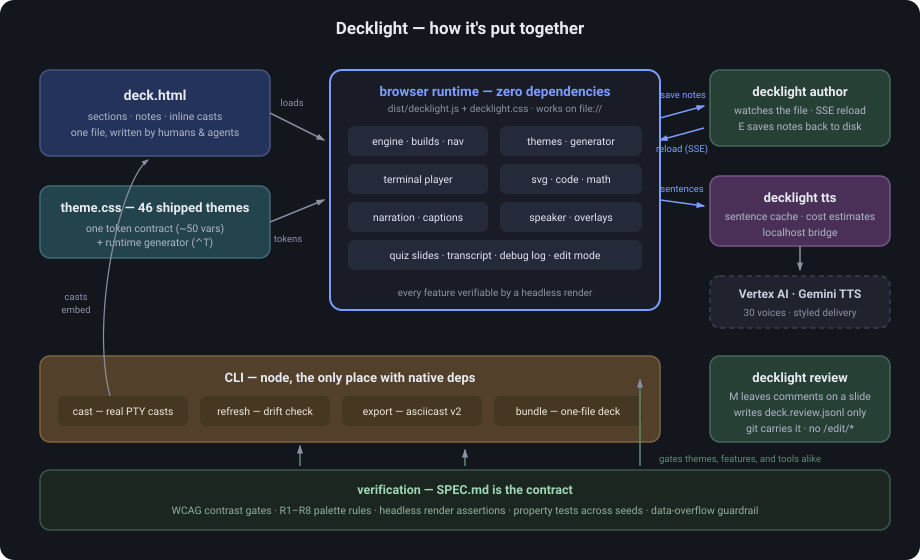

# Decklight

**The presentation library that presents itself.**

A deck is a single HTML file — no build, no server, no framework. You describe a slide in plain English, your AI agent writes it, and because agents can't squint at a screen, every feature is **verifiable by a headless render**: clipped content flags itself, every theme passes machine-checked contrast gates, and terminal demos are recorded truth rather than screenshots.

## Why I built this

I have lost more hours than I'd like to admit fighting my slides instead of writing them.

Keynote pins me to one laptop and a proprietary file I can't diff. PowerPoint turns a two-line edit into a fifteen-minute wrestle with alignment guides. Google Slides makes me watch a spinner to move a box three pixels. And all three share the same original sin: the deck is a **binary blob**. You can't grep it, you can't code-review it, you can't hand it to a program and say "fix the contrast on slide 12." When something's wrong, *you* are the one clicking around at 11pm.

I wanted the opposite of that. A deck that is **plain text** end to end — one HTML file you can read, diff, and email — with a runtime that has **zero dependencies** and runs straight off `file://`. Everything is text, so decks live happily in git, and anything that can read text can read your slides.

But the real reason this project exists is the second half: I wanted a codebase where **bugs and features ship at the speed of light**, because the AI agents do the heavy lifting. Open an issue in the morning, and by lunch an agent has reproduced it, another has drafted a spec with real rendered mockups, and — once I give the nod — a third has implemented it, proven it with a screenshot, and merged it green. That's not a someday aspiration; it's [how this repo runs today](#how-decklight-itself-ships-at-agent-speed). Decklight is built the way it's meant to be used: humans decide *what*, agents handle *how*, and a wall of automated verification keeps everyone honest.

> `SPEC.md` is the full contract and `demo/showcase.html` is the exhaustive self-demo. **This README is the quick tour.** For the two-minute version, open **`demo/intro.html`** — a short deck that explains what Decklight is, each slide live-demoing the feature it describes. See it all live at **[decklight.io](https://decklight.io)**.

## What you get

- **Agent-native** — describe a slide to your favorite agent; `init` hands it a skill with the real contract, and overflow flags + contrast gates + headless-render assertions let it check its own work without eyes.
- **One file, zero build** — author a single HTML file, double-click it, present. No toolchain, no server, no framework.
- **Diagrams & graphics** — native, theme-aware inline SVG, not just bullet lists.
- **Animation** — progressive builds, Magic Move between slides, and diagrams that draw themselves in.
- **46 built-in themes** — every one passes WCAG contrast gates and codified palette rules; generate your own with a keystroke.
- **Truthful terminals** — real PTY recordings replayed truthfully, never a video.
- **Live narration** — text-to-speech presents the deck by itself, in sync, captions included.
- **Everything is text** — no binary formats, so decks diff cleanly in git and agents can read, review, and edit every byte.
- **Safe to receive** — `decklight present` plays a deck you did not author read-only under a CSP, prints what the file will execute, and strips what it cannot account for. `publish` signs; a `.decklight` container is verified before it renders.
- **Extensible without shipping code to the audience** — themes, templates, engines, importers and presenter chrome install from git-repo marketplaces anyone can host; build-time transforms run on your machine during `bundle`, so nothing executable travels with the deck.

## Quick start

```
npx decklight init "My Deck"
```

This scaffolds a self-contained `deck.html` (double-click it — no server) **and** a `.claude/skills/decklight/` skill + `AGENTS.md`, so Claude Code (or anything that reads `AGENTS.md`) has the full authoring contract on hand instead of guessing from Reveal.js memory. The skill is sliced straight from `SPEC.md`, so it never drifts from the runtime you actually installed.

**Claude Code on the web** reaches the skill two ways. A committed `.claude/skills/decklight/` loads with the clone, so cloud sessions on that repo have it already — that is the per-project route and it needs nothing but a `git commit`. For every project at once, `decklight skills claude --pack` writes `decklight-skill.zip` to upload in your claude.ai skill settings. (`--global` installs into `~/.claude/skills/`, which local sessions read but cloud machines never see.)

Prefer to write the HTML yourself? Here's the whole anatomy:

```html
<!doctype html>
<html lang="en">
<head>
  <meta charset="utf-8">
  <link rel="stylesheet" href="decklight/dist/decklight.css">
  <link rel="stylesheet" href="decklight/themes/aurora.css">
</head>
<body>
  <div class="decklight">
    <section>
      <h2>A plain HTML slide</h2>
      <p>With an auto-detected subtitle</p>
      <ul data-build>
        <li>First point</li>
        <li>Second point — steps in on the next advance</li>
      </ul>
      <aside class="notes">Speaker notes. ⟨CLICK⟩ markers align with builds.</aside>
    </section>
  </div>
  <script src="decklight/dist/decklight.js"></script>
  <script>Decklight.init({ transition: 'fade' });</script>
</body>
</html>
```

Open it in a browser — `file://` works for everything, no server needed.

## How authoring works

The whole loop is agent-friendly and stays in one file end to end:

1. **`decklight init`** — scaffold a starter deck plus the agent skill above.
2. **Author** one HTML file: `<section>` slides, `data-build` reveals, inline SVG with theme tokens, `<aside class="notes">` split on `⟨CLICK⟩` (notes drive builds, captions, transcript **and** narration all at once).
3. **`decklight author deck.html`** — the whole live loop under one Ctrl-C: live-reload editing (from your editor or the browser), plus any narration/lip-sync bridges this machine can run (missing prerequisites are skipped with the fix printed, never a hard failure). In the browser: **`E`** edits notes back into the file, **`L`** cycles layouts, **`Z`/`⇧Z`** undo/redo, and **`A`** asks an installed coding agent — Claude Code, Codex, Gemini, Copilot, Aider and more, auto-detected from `$PATH` — to edit the deck headlessly; the page reloads when it saves. Edits auto-commit as you go.
4. **`decklight rec script.term.yaml`** — record a truthful terminal cast in a real PTY.
5. **`decklight bundle deck.html --themes all`** — flatten runtime, themes, casts and narration into one offline HTML file to hand off.

## Features at a glance

| Feature | In one line | More |
|---|---|---|
| **Builds** | `data-build` on a container — each child is a step; the layout never jumps | [SPEC BUILDS](SPEC.md#builds--builds-keynote-style-reveal-calls-these-fragments) |
| **SVG diagrams** | inline SVG authored with `var(--d-*)` tokens; recolors with every theme, strokes draw in | [SPEC SVG_DIAGRAMS](SPEC.md#svg_diagrams--svg-diagrams-first-class) |
| **Motion** | slide transitions, Magic Move auto-animate, looping element effects — all respect reduced-motion | [SPEC MOTION](SPEC.md#motion--motion) |
| **Theming** | 46 themes in 2 packs on one token contract; `T` picker, `⌃T` generates a contract-complete theme | [SPEC THEMING](SPEC.md#theming--the-token-contract) |
| **Code** | highlight.js themed through `--hl-*` tokens; `data-lines` steps highlight ranges as builds | [SPEC CODE_AND_MATH](SPEC.md#code_and_math--code--math) |
| **Math** | `data-math` renders `$$…$$` / `\(…\)` LaTeX to native MathML via bundled Temml — no webfonts, no build step | [SPEC CODE_AND_MATH](SPEC.md#code_and_math--code--math) |
| **Terminals** | `decklight rec` captures real PTY output; replayed by typing then streaming, never a video | [SPEC TERMINAL_RECORDINGS](SPEC.md#terminal_recordings--terminal-recordings) |
| **Presenting** | speaker view, rehearse cue cards, overview, command palette, slide finder — all on `file://` | [SPEC PRESENTING](SPEC.md#presenting--presenting--output) |
| **Narration** | TTS reads your notes in sync with builds; the voice is the clock, captions + auto-advance | [SPEC PRESENTING](SPEC.md#presenting--presenting--output) |
| **Integrity** | read-only `present` under a real CSP header, an ingredients label of what a deck executes, Sigstore signing, the `.decklight` container | [SPEC PRESENTING](SPEC.md#presenting--presenting--output) |
| **Marketplaces** | git-repo catalogs, registered not fetched; themes, templates, skills, voices, engines, importers, transforms and presenter plugins | [SPEC MARKETPLACE_REGISTRY](SPEC.md#marketplace_registry--marketplaces-registered-not-fetched) |

## CLI

| Command | Purpose |
|---|---|
| `decklight init ["Title"]` | scaffold a self-contained starter deck + an agent skill (run bare in a terminal, it asks for the title and offers a git repo; `--open` launches the deck, `--from <template>` starts from a marketplace template) |
| `decklight skills [agent…]` | install the authoring skill for Claude, Codex, OpenCode or IBM Bob (detected, named, or `--all`; `--global` for every project; `--pack` zips it for upload) |
| `decklight author deck.html` | **the whole authoring loop in one command** — live reload + every bridge this machine can run |
| `decklight present deck.html` | **play a deck you did not author** — read-only over localhost under a CSP header, with an ingredients label and `--strict` |
| `decklight import talk.pptx` | bring a PowerPoint, Keynote or Google Slides deck across (`.key` needs macOS; a Slides URL must be link-shared) |
| `decklight rec script.term.yaml` | record a terminal cast in a real PTY (`refresh` re-runs them, `export` flattens to asciicast v2) |
| `decklight restore deck.html` | list the commits that touched a deck, and put it back to any of them |
| `decklight upgrade deck.html` | bring a self-contained deck's inlined runtime + themes up to the installed version |
| `decklight bundle deck.html [--all]` | flatten to a self-contained single-file HTML (`--sign` attests it, `--deck` wraps it as `.decklight`) |
| `decklight publish deck.html` | bundle and push to GitHub Pages — signed by default; Netlify and Vercel install as targets |
| `decklight pdf deck.html` | one slide per page, at its own size, in its theme — no print dialog |
| `decklight video deck.html` | render to one narrated mp4 (`--voiceover` synthesizes the narration first) |
| `decklight theme check\|add` | validate a theme against the token contract, or install one into a deck |
| `decklight marketplace add owner/repo` | register a catalog — cloned once with **your** git credentials (so a private one works), then read from disk |
| `decklight plugin add timer` | presenter chrome into **your** library: `present` loads it, `bundle` never does |
| `decklight template\|importer\|transform\|engine\|voice\|agent add …` | the rest of the unit library — deck templates, import adapters, build-time transforms, speech engines, voices, agent descriptors |
| `decklight extension check t.mjs` | the marketplace admission gate for a transform: lint, then a headless load of its output |
| `decklight associate` | wire double-clicking a `.decklight` file to `decklight present` (per-user, no admin rights) |
| `decklight tts` | live voice bridge — the player synthesizes narration through it |
| `decklight lipsync` | lip-sync bridge — visemes (rhubarb) + a talking head (your GPU); `--veo` animates the portrait |
| `decklight report-bug` | gather the version + environment facts a bug report needs, and print the issue URL |

`decklight help` lists every command and flag — `refresh` and `export` are in [SPEC TERMINAL_RECORDINGS](SPEC.md#terminal_recordings--terminal-recordings), `present` and `lipsync` in [SPEC PRESENTING](SPEC.md#presenting--presenting--output). (`decklight dev` still works as a hidden alias for `author`; `decklight edit` was folded into it and refuses out loud.) Drive a deck programmatically with the [JS API](SPEC.md#js_api--public-js-api). The runtime has **zero dependencies** (highlight.js and temml are bundled at build time); `node-pty` and `js-yaml` are CLI-only.

## Keys

| Key | Action |
|---|---|
| `→` `←` `Space` | next / previous build or slide |
| `S` | speaker view (again: rehearse cue cards) |
| `T` | theme picker (type to filter) · `⌃T` generate a theme |
| `V` | narration on/off |
| `/` | command palette · `G` find a slide |
| `?` | help overlay — every key |

## Install on another machine

```sh
git clone https://github.com/decklight/decklight && cd decklight
npm install        # dev deps for building/recording; decks only need dist/ + themes/
npm run build
```

A deck references `dist/decklight.{js,css}` and one theme file — copy those three files (or a single `bundle`) and nothing else.

## How Decklight itself ships at agent-speed

The whole point was a project where fixes and features land fast because agents do the work and automated verification keeps it safe. So the repo runs itself as a pipeline of small, single-purpose GitHub Actions — each one a Claude agent with exactly the powers it needs and no more:

- **You open an issue.** An agent reads it *and the code it blames*, then either asks the missing questions or routes it — a bug goes to a reproduction agent (which actually builds `main` and tries it, posting screenshots of what it saw), a feature goes to a spec agent (which drafts acceptance criteria and renders real UI mockups for review).
- **You approve.** Applying `ready-to-dev` is the one human gate. An implementation agent writes the code on a branch, proves it with `npm run verify` and a screenshot of the feature actually working, and opens a PR with that picture inline. You review the *screenshots*, not the merge button — the PR merges itself once CI is green.
- **The loop keeps itself unstuck.** If CI goes red, a fix agent reads the failing logs and repairs the branch (capped, so it never argues with a red build forever). If `main` moves and a branch goes stale, a rebase agent replays it cleanly. A grooming pass reads the backlog daily and closes what the code already fixed — citing the exact `file:line` as proof.

Every one of those agents runs under the same rule: on a public repo, an automated trigger never hands a push token to an agent reading text a stranger can write. The agents that need a shell run credential-less; the tokens live only in plain shell steps; a verification band — WCAG contrast gates, palette rules, headless-render assertions, property tests — holds all of it to `SPEC.md`. The `.github/workflows/` files each open with a header explaining *why* they're shaped the way they are; they're worth a read if you like this sort of thing.

## Architecture

<p align="center">
  
</p>

One HTML file and one theme stylesheet feed a **zero-dependency browser runtime**; everything with native dependencies or credentials lives in **localhost tools** (the CLI, the `edit` live-reload server, the `tts` bridge); and a **verification band** — contrast gates, palette rules, headless render assertions, property tests — holds all of it to the `SPEC.md` contract.

## Development

`npm test` (unit + property tests) · `node test/render.mjs` (headless-Chrome render assertions) · `node test/contrast.mjs` (WCAG theme gates) · `npm run verify` for the lot. The house rule: every feature is verified end-to-end against a real render, not just unit-tested — see SPEC REPO_LAYOUT, and `CONTRIBUTING.md` for the DCO sign-off every commit needs.

## Links

- **[decklight.io](https://decklight.io)** — the showcase deck, live and narrating itself
- **`demo/intro.html`** — the short "what is Decklight" tour
- **`demo/showcase.html`** — the full self-demo, every feature on its own slide
- **[`SPEC.md`](SPEC.md)** — the authoring contract
- **[`CONTRIBUTING.md`](CONTRIBUTING.md)** — how to contribute (DCO sign-off required)

## License

Decklight is free and open source, released under the [Apache License 2.0](LICENSE). Contributions are welcome — see [CONTRIBUTING.md](CONTRIBUTING.md).
