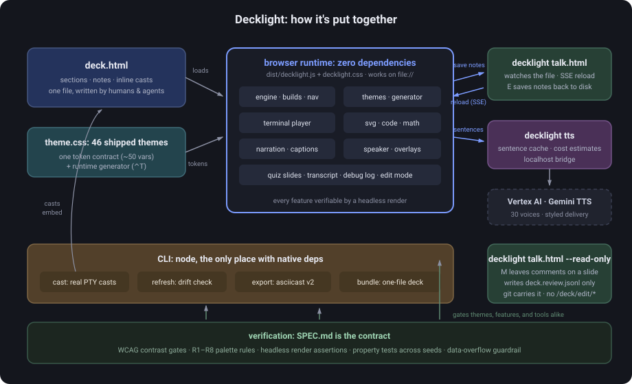

# Decklight

A presentation library for people who would rather write their slides than
fight them. A deck is one HTML file. The runtime is one JS file, one CSS file
and a theme, with no dependencies and no build step. It opens straight from
`file://`, it diffs cleanly in git, and an AI agent can read, write and verify
every byte of it.

It is live at [decklight.io](https://decklight.io). The two-minute version is
`demo/intro.html`, the exhaustive one is `demo/showcase.html`, and the contract
everything is built against is [`SPEC.md`](SPEC.md).

## Why

I got tired of decks being binary blobs. You can't grep a Keynote file, you
can't code-review a PowerPoint, and when slide 12 has a contrast problem at
11pm, you're the one clicking around. I wanted a deck that is plain text end to
end, and a codebase where an agent can do most of the work because it can check
its own results: clipped content flags itself, every theme passes a
machine-checked contrast gate, and a headless render is the test.

That second half is also how this repo runs. Issues are triaged, reproduced,
specified and implemented by agents, and a human approves what ships.
[`CONTRIBUTING.md`](CONTRIBUTING.md) explains the loop if you're curious.

## Quick start

```sh
npx decklight@latest init "My Talk" --dir my-talk
```

That writes a `deck.html` in `my-talk/` (slides plus a two-line configuration
block, nothing else) plus a
`.claude/skills/decklight/` skill and an `AGENTS.md`, so Claude Code (or any
agent that reads `AGENTS.md`) has the real authoring contract on hand instead of
guessing from Reveal.js memory. Then it asks whether to open the deck in write
mode: live reload, edits from the browser, an AI agent on `A`, and git
underneath: your work snapshotted as you go, committed when you press `K`.
Say yes. Leave out `--dir` to start the deck in the current directory. Keep the
`@latest`: npx resolves it against the registry on every run, so you always
get the current release, whereas a bare `npx decklight` runs any decklight
already installed in the project or globally, however old.

Prefer npm's own scaffolding command? This does the same thing, naming the
deck after its folder ("My Talk"):

```sh
npm create decklight my-talk
```

After that you rarely need a command name:

```sh
decklight                 # in a folder: start a deck, or pick one to open
decklight talk.html       # open a deck: write mode, live reload, an AI agent on A
decklight talk.html --no-trust   # open one you did not write: no-trust mode
decklight https://github.com/you/talk  # clone a deck's repository and open it
decklight talk.pptx       # bring a PowerPoint, Keynote or Slides deck across
decklight talk.decklight  # play somebody else's deck, without trust
decklight bundle talk.html  # one self-contained file to send — the runtime embedded
decklight doctor          # what this machine can do, and how to get the rest
```

Type a command wrong and it tells you which one you meant. Or skip the scaffold
and write the HTML yourself. A deck you author is *data* (slides and a JSON
configuration block) and `decklight <deck>` adds the runtime as it serves it, in write mode and in `--no-trust`;
`bundle` embeds it when you hand the file over. This is the whole anatomy:

```html
<!doctype html>
<html lang="en">
<head>
  <meta charset="utf-8">
  <script type="application/json" data-decklight-config>
  { "decklight": "0.9.0", "theme": "aurora", "transition": "fade" }
  </script>
</head>
<body>
  <div class="decklight">
    <section>
      <h2>A plain HTML slide</h2>
      <p>With an auto-detected subtitle</p>
      <ul data-build>
        <li>First point</li>
        <li>Second point, revealed on the next advance</li>
      </ul>
      <aside class="notes">Said before the first point. [click] Said as the first appears. [click] And as the second.</aside>
    </section>
  </div>
</body>
</html>
```

Nothing in that file executes. A deck that prefers to load the runtime
itself (`<script src="decklight/dist/decklight.js">` and a
`Decklight.init({ … })` call) is served exactly as written.

## What's in the box

- **Editing in the browser.** In write mode, double-click any text (or a
  code block, edited as plain source) to change it, drop a picture onto a
  slide to add it, and add, duplicate, move or delete slides from the palette
  or the right-click menu. Inside a diagram, a click selects one shape, wire
  or label: `I` opens the inspector on it, with a Colors tab and a Type tab
  (size, weight, the theme's font role, italic, alignment) that save as you
  pick, and a picker that hovers shapes the way DevTools does, each boxed in
  the theme's accent; a double-click retypes a label in place and `⌫` removes
  just that shape. The notes editor, the inspector and the agent ask dock
  beside the slide, wherever you left them. Every edit lands in the file and
  `Z` takes it back. `decklight check`
  reports what an author or an agent would otherwise only see by looking:
  clipped slides, missing images, notes whose [click] count disagrees with
  the builds.
- **Chapters.** `data-module` marks chapters, and `G` shows the outline.
- **Builds.** `data-build` on a container makes each child a step. The layout
  never jumps.
- **Diagrams.** Inline SVG written with `var(--d-*)` tokens recolours with every
  theme and can draw itself in, an arrowhead riding the tip and a dashed line
  drawing dashed from its first frame.
- **Motion.** Slide transitions, Magic Move between slides, looping element
  effects. All of it respects reduced-motion.
- **Themes.** 46 themes in 2 packs, every one behind WCAG contrast gates. `T`
  picks one, `⌃T` generates a new one that passes the same gates.
- **Code and math.** highlight.js styled through theme tokens, LaTeX rendered
  to MathML with bundled Temml. No webfonts, no build step.
- **Charts.** `data-chart` plus a small JSON block gives you a theme-aware SVG
  chart: bar, line, area, pie, donut, scatter.
- **Terminals.** `decklight cast` records a real PTY session and the deck
  replays it, typing and streaming. Never a video.
- **Narration.** Text-to-speech reads your notes in sync with the builds, or you
  record your own voice one beat at a time. Captions and auto-advance come with
  it. The notes are the script, and a script's own markers work as written:
  `[pause]` holds a beat, `[long pause]` two, `[click]` cuts a beat, in any
  spelling. ElevenLabs v4 (the default model) acts on audio tags
  like `[whispers]` or `[laughs]`; any other voice leaves them out. Your agent
  can add those tags, or write terse notes for the ear, as sentences a person
  would say, and the notes editor shows before and after until you save.
  ElevenLabs voices are listed by language, and the voice library finds a
  native one for a translated deck. A synthesized recording tells you what it
  cost: clips reused against clips sent to the engine.
- **A face for the voice.** `V` → Character: a 2D narrator whose lips follow
  the voice, or a talking head made from your photo (or from a few seconds of
  you filmed in the deck) lip-synced with Wav2Lip on your own machine, set up
  once with `decklight lipsync … --save`.
- **Video.** `decklight video` renders the deck to mp4, mov or webm, narrated
  by its track with subtitles in the file or beside it, and re-voices a slide
  whose notes moved. The same export is a palette row, which can voice the
  range with the live voice first.
- **Review.** Reviewers comment on slides, the review travels as a git branch,
  and a comment finds its slide again after the deck has moved. The author
  answers from inside the deck, and `I` shows what a slide is standing on:
  its sources, written from inside the deck too.
- **In and out.** PowerPoint, Keynote and Google Slides come in, with charts as
  data, SmartArt as diagrams, and what somebody drew (shapes, lines, groups,
  rotation) as the drawing it was. PDF and PowerPoint go out for whoever
  still asks, in the theme on screen.
- **Safe to receive.** A deck that runs code of its own is named before it
  opens, and asked about: trust its source and it opens in write mode, decline
  and it plays without trust under a CSP with that code stripped. `--no-trust`
  forces the safe mode; `publish` signs what it ships.
- **Design systems.** A company's tokens, art and slide templates, referenced
  by a deck from a marketplace and served into it, never copied: a slide names
  a template, fills its slots, and follows the system when it changes. `/` →
  *Design systems…* and *Use slide template…* in write mode.
- **Extensible without shipping code to the audience.** Themes, skills,
  speech engines and presenter plugins install from any git repo. Nothing
  executable travels inside a deck.

Every item above has a SPEC section behind it. The index at the top of
`SPEC.md` maps the names to the sections.

## The CLI

`decklight help <command>` prints the flags for any of these.

| Writing | |
|---|---|
| `init ["Title"]` | scaffold a deck and the agent skill, then open it in write mode (`--no-open` keeps the browser closed) |
| `skills [agent…]` | install the authoring skill for Claude, Codex, OpenCode or IBM Bob; a skill older than this build is refreshed, and write mode names one at startup |
| `<deck.html \| url>` | the deck is the command. Write mode: live reload plus every bridge this machine can run, under one Ctrl-C (`--open` for the browser; a git URL clones the repo and opens the deck inside). In the browser editing is on: double-click text to edit it (`⌘B`, `⌘I`, `⌘E` for bold, italic and code while you do), drop a picture onto a slide, `L` for a layout, `S` for notes, `O` to rearrange slides; `Lock deck` in the palette turns changes off until you unlock |
| `check deck.html` | lint it headlessly: clipped slides, missing assets, [click] beats out of step with the builds (`--json`) |
| `record deck.html` | record the narration in your own voice, one [click] beat at a time |
| `cast script.term.yaml` | record a terminal session in a real PTY (`refresh` re-runs, `export` writes asciicast) |

| Sharing | |
|---|---|
| `<deck> --no-trust` | open a deck you didn't write in no-trust mode: every edit route refuses, it is served under a CSP, and what it will execute is listed first (a repository URL clones it first, into the same clone write mode uses). Comments (`M`) work here too; a `.decklight` is without trust by nature |
| `bundle deck.html` | one self-contained HTML file (`--all` merges a playlist, `--sign`, `--deck`) |
| `publish deck.html` | bundle and push to GitHub Pages, Netlify, Vercel or a folder |
| `pdf deck.html` | one slide per page (`--notes`, `--handout`) |
| `pptx deck.html` | a PowerPoint file, every slide a picture, notes as notes |
| `video deck.html` | a narrated video: mp4, mov or webm, with subtitles in it or beside it (`--format`, `--quality`, `--subtitles`; `--slides 5-9` for part of it, `--voiceover` synthesizes first; also **Export a video…** in the deck's palette, which can voice it with the live voice first) |
| `voiceover deck.html` | batch-synthesize the narration into a folder |
| `enhance deck.html --slides 3` | add ElevenLabs v4 audio tags to the notes with the prompt ElevenLabs publishes: your agent drafts, decklight checks no word changed (`--all`, `--dry-run`) |
| `enhance deck.html --spoken --slides 3` | write terse notes for the ear, as sentences a person would say: your agent rewrites, decklight checks every `[click]` and `[pause]` survived |

| Keeping track | |
|---|---|
| `comments deck.html` | what reviewers said, resolved against the deck as it is now; `comments submit` sends a reviewer's comments back as a branch |
| `history deck.html` | what decklight committed and what is only on this machine |
| `restore deck.html` | put the deck back to any commit that touched it |
| `upgrade deck.html` | bring a bundled deck's inlined runtime up to this version (`--link` un-embeds it, so the deck is data again) |

| Bringing things in | |
|---|---|
| `import talk.pptx` | convert PowerPoint, Keynote or Google Slides (`--theme template` keeps its palette, `--shapes strict` draws only snapped diagrams) |
| `theme check\|add` | validate a theme against the token contract, or install one |
| `marketplace add owner/repo` | register a catalog; it is cloned with your git credentials, then read from disk |
| `design-system add acme@acme-mkt talk.html` | reference a company's design system: its tokens, art and slide templates, served from the marketplace on this machine (`list`, `templates`, and `check`, the gate a catalog runs) |
| `font add inter@type-mkt talk.html --use` | reference a typeface from a marketplace: its faces and licence travel with the deck and its bundle, offline; `--use` opens the deck in it (`list`, and `check`, the gate a catalog runs) |
| `marketplace list` / `update <name>` | what each catalog offers, and what it now has newer than what you installed (`nord@acme 1.0.0 → 1.1.0`, and the command that takes it) |
| `plugin add <name>` | presenter chrome for your machine only; no-trust mode loads it, `bundle` never does |
| `importer\|transform\|engine\|voice\|agent add …` | the rest of the unit library |
| `extension check t.mjs` | the marketplace admission gate for a transform |

| Odds and ends | |
|---|---|
| `tts` / `lipsync` | the live voice bridge and the lip-sync bridge the player talks to |
| `associate` | make double-clicking a `.decklight` file open it without trust |
| `report-bug` | print the version and environment facts a bug report needs |
| `doctor` | what this machine can do (Chrome, ffmpeg, git, agents…) and the install line for what it can't |

The runtime has zero dependencies. highlight.js and Temml are bundled at build
time; `node-pty`, `js-yaml`, `sigstore` and Playwright are optional and used by
the CLI only.

## Keys

| Key | Action |
|---|---|
| `→` `←` `Space` | next / previous build or slide |
| `S` | this slide's speaker notes: editable in write mode, read-only under `--no-trust` |
| `⌥⏎` / `Alt+Enter` | speaker view: a second window with notes, next slide and timer (again: rehearse cue cards) |
| `T` | theme picker, `⌃T` generate a theme |
| `⎵` | play / pause the voice once one is chosen; otherwise it advances |
| `V` | everything about the voice: tracks, live voice, character, record, captions, speed |
| `M` | review comments: `⏎` jumps to the slide, `R` marks one done and again reopens it, `D` hides the done ones, `⌫` deletes one of yours; `⇧M` writes one |
| `K` | commit what you changed, with a message; `L` cycles the slide's layout; `⌘⏎` / `Ctrl+Enter` fullscreen |
| `H` | the deck's history, every version previewed live, `⏎` restores one |
| `I` | the inspector: everything about this slide, or the selected shape's colours and type; its sources |
| `/` | command palette, `G` find a slide |
| `?` | every key |

## Working from a checkout

```sh
git clone https://github.com/decklight/decklight && cd decklight
npm install          # also builds dist/
npm test             # unit tests
npm run verify       # build + headless render assertions, needs Chrome
```

A deck you author carries no runtime: `decklight <deck>` references
`dist/decklight.js`, `dist/decklight.css` and one theme file into it as they
serve it. To hand it over, `bundle`: one file, and nothing else to copy.

<p align="center">
  
</p>

Every commit needs a DCO sign-off (`git commit -s`). The rest of the process,
including how the agent loops work, is in [`CONTRIBUTING.md`](CONTRIBUTING.md).

## License

[Apache 2.0](LICENSE).
